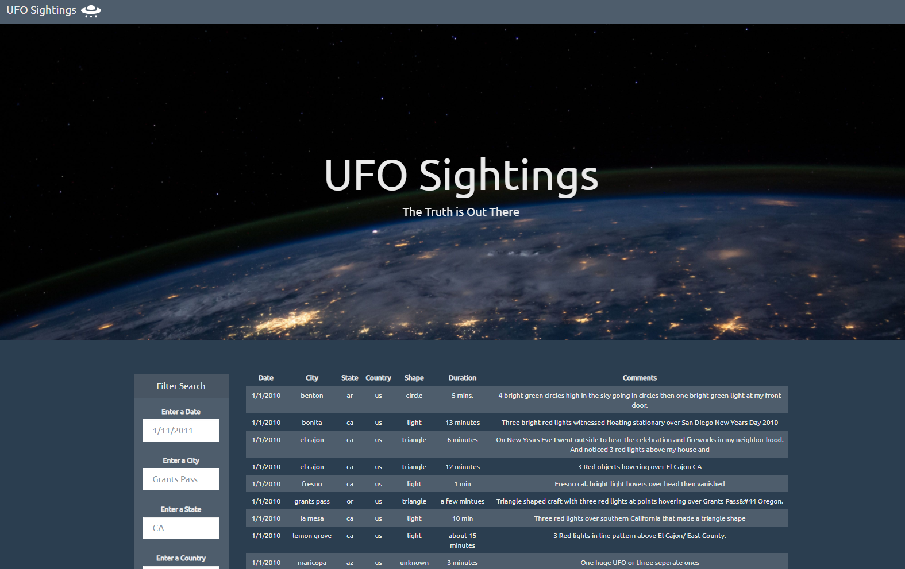
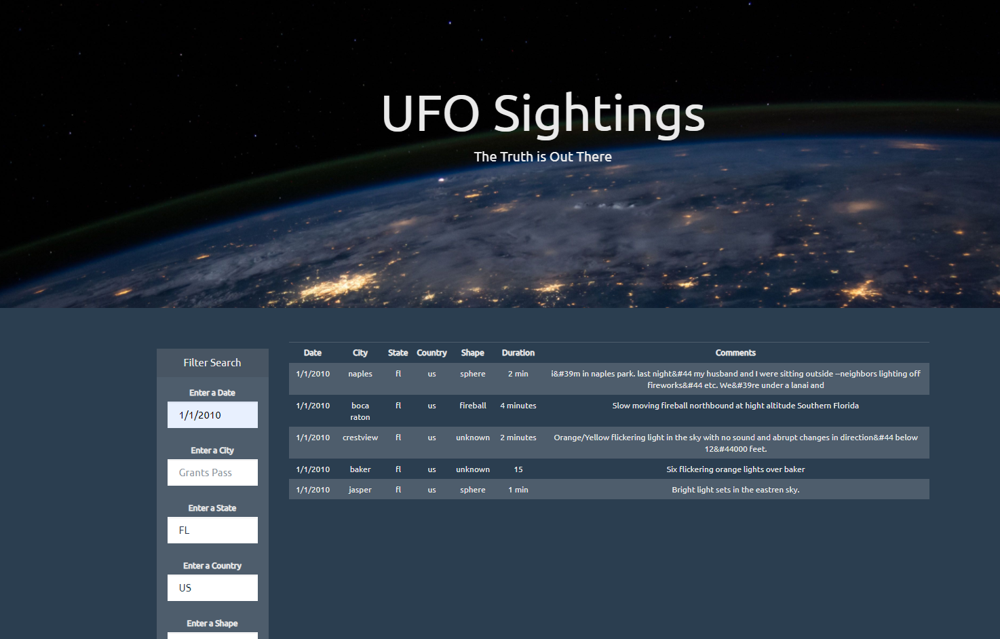

## Repository Info:

Repository Size: 4.91 MB

Code can be run using Visual Studio Code

Given a data set from 1/1/2010 to 1/14/2010; JavaScript, HTML, CSS, and D3.js are all used to code a webpage that has a dynamic table that can be filtered based on the given values of the specific data set for UFO sightings.

# UFO Finder

## Click <a href="https://caleman34.github.io/UFO_Finder/index.html" target= "_blank">here</a> for live webpage

## Homepage

## Filtered Results

## JavaScript Code

